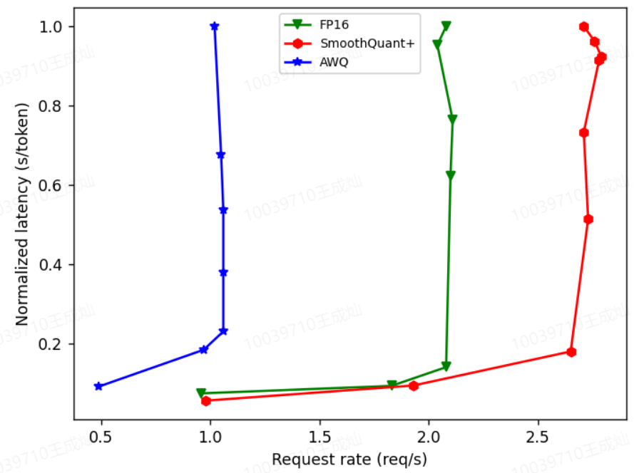
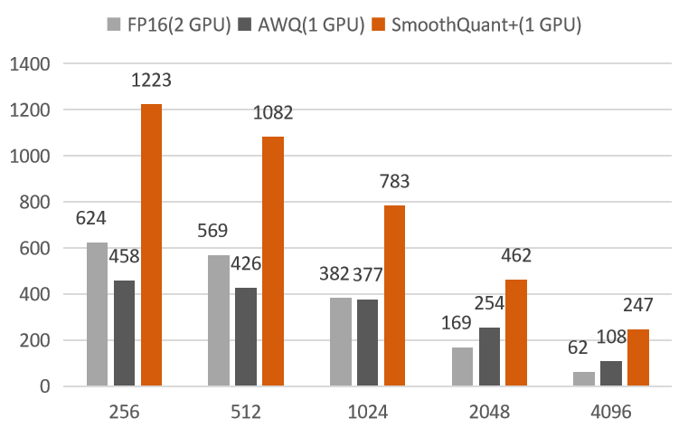

<p align="center">
  <picture>
    <source media="(prefers-color-scheme: dark)" srcset="https://raw.githubusercontent.com/vllm-project/vllm/main/docs/source/assets/logos/vllm-logo-text-dark.png">
    
  </picture>
</p>

<h3 align="center">
Easy, fast, and cheap LLM serving for everyone
</h3>

<p align="center">
| <a href="https://vllm.readthedocs.io/en/latest/"><b>Documentation</b></a> | <a href="https://vllm.ai"><b>Blog</b></a> | <a href="https://arxiv.org/abs/2309.06180"><b>Paper</b></a> | <a href="https://discord.gg/jz7wjKhh6g"><b>Discord</b></a> |

</p>

## Performance Comparison

vLLM is a fast and easy-to-use library for LLM inference and serving.

vLLM is fast with:

- State-of-the-art serving throughput
- Efficient management of attention key and value memory with **PagedAttention**
- Continuous batching of incoming requests
- Optimized CUDA kernels

vLLM is flexible and easy to use with:

- Seamless integration with popular Hugging Face models
- High-throughput serving with various decoding algorithms, including *parallel sampling*, *beam search*, and more
- Tensor parallelism support for distributed inference
- Streaming outputs
- OpenAI-compatible API server


## Install
Install vLLM with pip or [from source](https://vllm.readthedocs.io/en/latest/getting_started/installation.html#build-from-source):

```bash
pip install vllm
```

## Quantization
Quantization in previous versions already supports AWQ and SqueezeLLM quantization. This submission adds an int8 quantized submission, using the bitsandbytes core to perform 8-bit operations. At the same time, we also submitted a new 4-bit quantization implementation. We implement 4-bit groupwise quantization (RTN) for linear layers on vLLM. The smoothed model is directly loaded into vLLM, which automatically completes 4-bit weight quantization. In vLLM, we have implemented an efficient W4A16 CUDA kernel optimized from lmdeploy for the quantization of linear layers, which further enhances the acceleration effect. We will soon submit a [smoothquant+](https://arxiv.org/abs/2312.03788) algorithm to another git library. This algorithm smoothes the model by channel. By using SmoothQuant+, the Code Llama-34B can be quantified and deployed on a single 40G A100 GPU, with lossless accuracy and a throughput increase of 1.9-4.0 times compared to the FP16 model deployed on two 40G A100 GPUs. The latency per token is only 68% of the FP16 model deployed on two 40G A100 GPUs. This is the state-of-the-art 4-bit weight quantization as we know.

<div style="display:inline-block">
  
  
</div>

Configuring int8 or int4 is also very simple, just set auto_quant_mode to llm_int8 or weight_int4.

```python
llm = LLM(model="facebook/opt-125m",
          trust_remote_code=True,
          dtype='float16',
          #auto_quant_mode="llm_int8")
          auto_quant_mode="weight_int4")
```

## Acknowledgements

We would like to thank the following projects for their excellent work:
- [vllm](https://github.com/vllm-project/vllm)
- [LMDeploy](https://github.com/InternLM/lmdeploy)
- [AWQ](https://github.com/mit-han-lab/llm-awq)
- [FasterTransformer](https://github.com/NVIDIA/FasterTransformer)
